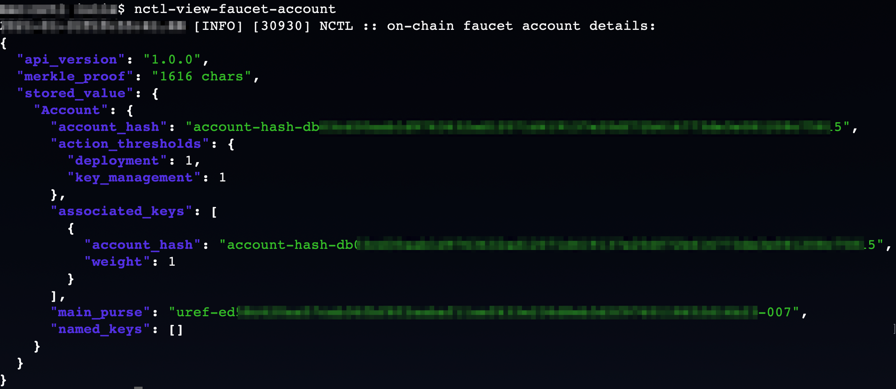
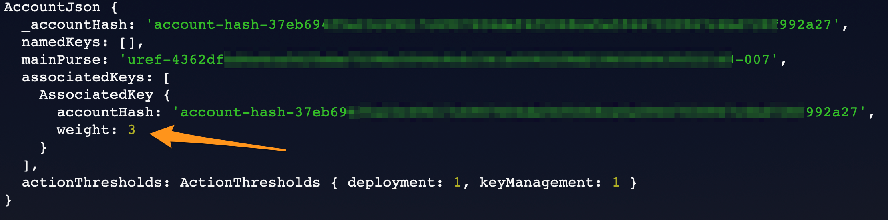
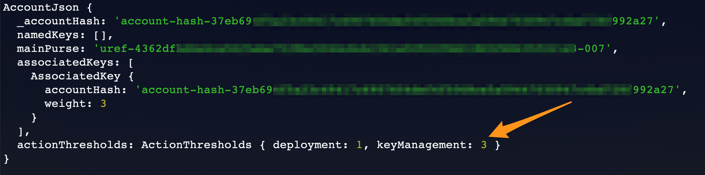
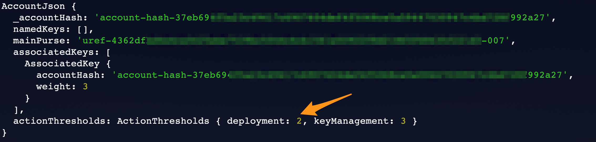
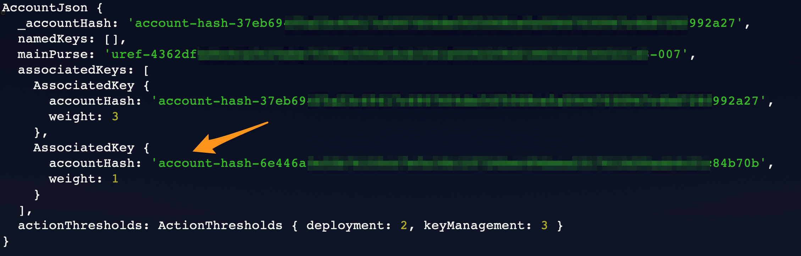
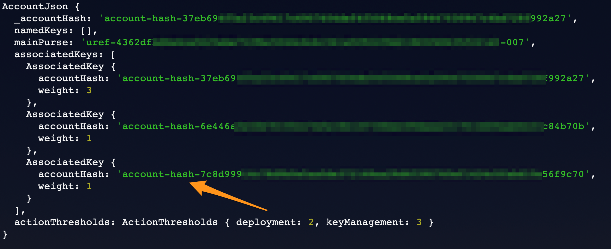
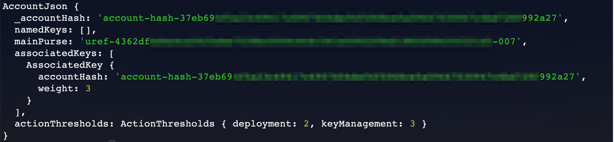

Client Example
==============
This section covers an example client that invokes a smart contract for key management. In addition to the main account, the client code will add two additional accounts to perform deployments. The two deployment accounts will perform deployments but will not be able to add another account.

Prerequisites
^^^^^^^^^^^^^
* You have compiled the `example contract <https://github.com/casper-ecosystem/keys-manager>`_ for key management
* You have set up the `nctl <https://github.com/CasperLabs/casper-node/tree/master/utils/nctl>`_ tool

Setting up the Network
^^^^^^^^^^^^^^^^^^^^^^^
You can use the `nctl <https://github.com/CasperLabs/casper-node/tree/master/utils/nctl>`_ tool to set up a local network for this tutorial.

Navigate to your ``casper-node`` folder and run the following commands.

.. code-block:: bash

	$ nctl-compile
	$ nctl-assets-setup
	$ nctl-start
	$ nctl-view-faucet-account

The network you created with the nctl tool has a special account called a faucet account, which holds your tokens. You will need these tokens to interact with the network. If the network is up and running, you will be able to see your faucet account details.

| 

Setting up the Client
^^^^^^^^^^^^^^^^^^^^^^^
Navigate back to your ``keys-manager/client/src/`` folder and open the ``utils.js`` file. Explore the set up needed for your client to communicate with the network.

This client code expects a compiled WASM file in the ``contract`` folder and a local network called ``casper-net-1`` with the following configuration.

========================  ================================================  =============
Variable                  Description                                       Value
========================  ================================================  =============
nodeUrl                   The URL of the first node in your local network.  http://localhost:40101/rpc
eventStoreUrl             The URL where events are posted.                  http://localhost:3000
wasmPath                  The path of the compiled WASM contract.           ../contract/target/wasm32-unknown-unknown/release/keys-manager.wasm
networkName               The name of your local network set up by nctl.    casper-net-1
========================  ================================================  =============

Specify your faucet account path on the following line. Replace <ENTER_YOUR_PATH> with your own path.

.. code-block:: javascript

	let baseKeyPath = "<ENTER_YOUR_PATH>/casper-node/utils/nctl/assets/net-1/faucet/";

The following line in ``utils.js`` creates a client that connects to the Casper network. This is the main-facing piece of this library.

.. code-block:: javascript

	let client = new CasperClient(nodeUrl, eventStoreUrl);

The rest of the code in this file creates functions for account management, funding the account, and issuing deployments to the local network.

**Setting up the Account using a Key Manager**

Next, open the ``keys-manager.js`` file to explore how the client code implements key management.

In the code, we set the weight for the main account to 3. The state of the account at this point is shown in the image below.

.. code-block:: javascript

	deploy = utils.keys.setKeyWeightDeploy(mainAccount, mainAccount, 3);

| 

Next, we set the key management threshold for the main account to 3. With this threshold, you can manage other keys and have control over the entire account.

.. code-block:: javascript

	deploy = utils.keys.setKeyManagementThresholdDeploy(mainAccount, 3);

| 

Next, the client code sets the deployment threshold to 2 for this account.

.. code-block:: javascript

	deploy = utils.keys.setDeploymentThresholdDeploy(mainAccount, 2);

| 

The next step is to add a new key with weight 1. You cannot do anything with this key alone since all the action thresholds are higher than 1.

.. code-block:: javascript

	deploy = utils.keys.setKeyWeightDeploy(mainAccount, firstAccount, 1);

| 

We will add another key with weight 1. If you use this key with the second key, you can deploy, since the weights add up to 2.

.. code-block:: javascript

	deploy = utils.keys.setKeyWeightDeploy(mainAccount, secondAccount, 1);

| 

Next, we will transfer tokens from the main account and perform a deployment. When the deployment accounts sign the transaction, they can transfer funds from the faucet account since their combined weight is 2, which meets the deployment threshold.

.. code-block:: javascript

	deploy = utils.transferDeploy(mainAccount, firstAccount, 1);
	await utils.sendDeploy(deploy, [firstAccount, secondAccount]);

.. image:: ../../assets/tutorials/multisig/step_6.png
  :alt: Image showing the output of the funds transfer.

| 

If you dive into the `transferDeploy` function, you will see the transfer of funds.

.. code-block:: javascript

 function transferDeploy(fromAccount, toAccount, amount) {
    let deployParams = new DeployUtil.DeployParams(
        fromAccount.publicKey,
        networkName
    );
    let transferParams = DeployUtil.ExecutableDeployItem.newTransfer(
        amount,
        toAccount.publicKey
    );
    let payment = DeployUtil.standardPayment(100000000000);
    return DeployUtil.makeDeploy(deployParams, transferParams, payment);
 }

After the above transfer of funds, the client code removes both deployment accounts.

.. code-block:: javascript

	...
	deploy = utils.keys.setKeyWeightDeploy(mainAccount, firstAccount, 0);
	...
	deploy = utils.keys.setKeyWeightDeploy(mainAccount, secondAccount, 0);
	...

We are left with the following account structure:

| 

In the next section, you will test your key management implementation.
