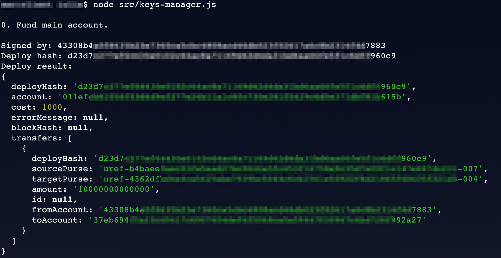
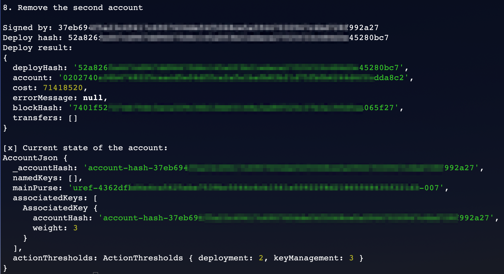

Testing your Client
===================

You will now test your client using `nctl <https://github.com/CasperLabs/casper-node/tree/master/utils/nctl>`_ and `Clarity <https://github.com/CasperLabs/clarity>`_. Clarity will run against your local nctl network and will help you interact with your local blockchain.

Prerequisites
^^^^^^^^^^^^^
* You have completed all the previous sections, and your local network is up and running using the `nctl <https://github.com/CasperLabs/casper-node/tree/master/utils/nctl>`_ tool.
* Install `yarn <https://yarnpkg.com/getting-started>`_ if you do not have it on your machine.

Commands
^^^^^^^^

Clone the `Clarity <https://github.com/CasperLabs/clarity>`_ repository:

.. code-block:: bash

    $ git clone https://github.com/CasperLabs/clarity

Navigate to the root of the clarity directory and run:

.. code-block:: bash

    $ yarn install
    $ yarn build

Clarity contains an event store, which you will use as a data source in your testing. The event store receives data from the node, which is saved in a SQL database.

Open a new terminal tab and start the event store by running these commands:

.. code-block:: bash

    $ cd packages/event_store
    $ rm developement_sqlite.db    // Removes old SQL data
    $ npm run start-web-server     // Starts the event store

Open another terminal tab and start processing the event stream:

.. code-block:: bash

    $ npm run start-event-handler  // Starts the event processing

Install the CasperLabs SDK for JavaScript:

.. code-block:: bash

   $ git clone https://github.com/casper-ecosystem/casper-client-sdk-docs
   $ npm install casper-client-sdk --save

Navigate to your ``/keys-manager/client`` folder and run the ``keys-manager.js`` using ``node``. The path of your WASM file is relative to the ``client`` folder, so you need to run the file from here.

.. code-block:: bash

    $ node src/keys-manager.js

If the code runs successfully, the beginning of the output would look like this:

|

Also, the end of the output would include removing the second key and would print the state of the account.

|

Congratulations! You have completed the tutorial.

You can now employ a similar strategy to set up your account using multiple keys.

We offer some additional examples of account management in the next section.