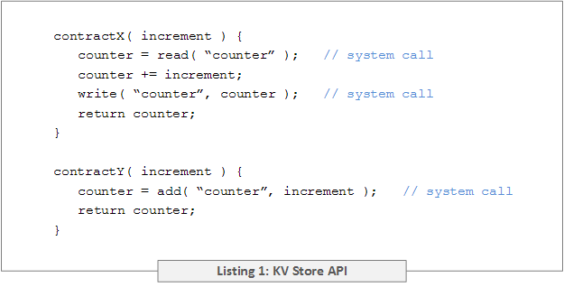
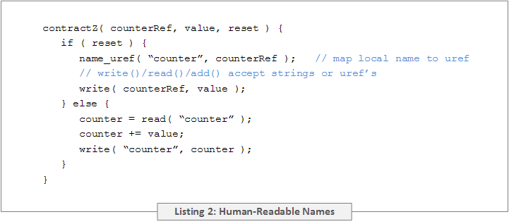
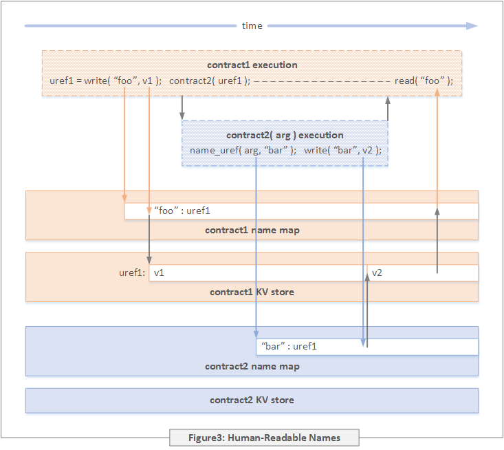
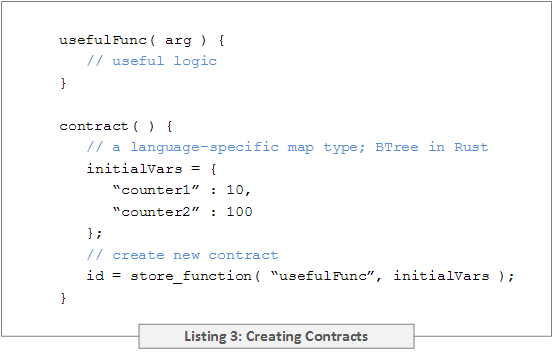
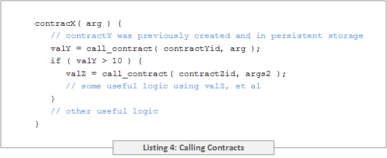

# Contract Programming Model

Contracts are simply functions written in any programming language supported by the system. As such, contracts can take arguments, call other contracts, and return values to their callers. All language-specific abstractions employed in the contract source (local variables, static variables, structs, objects, classes, etc.) have lifetimes restricted to the execution of the contract contained within that source module. With some restrictions, contract source may import libraries available in its language ecosystem, e.g. math. All library functions called from a contract must emit the same output if given the same input (the reason for this will be explained below). Contract source is required to import a language-specific system library provided by CasperLabs which contains functions and data types for using system services. Each contract is an independent namespace – a variable with the same name in different contracts maps to a different storage location.

The system makes a persisent key-value store available to each contract. Variables in the KV store persist between contract executions and are not visible to other contracts unless explicitly shared. The system library exposes three functions for accessing the KV store: read(), write(), and add(). Examples of their use is given in Listing 1.

If the variable named in a write() call does not already exist, it is created; it is an error if the variable named in a read() or an add() does not exist. It may appear that the behavior of contractX and contractY are identical however there is an important semantic difference which is discussed in more detail in the "Persistent Storage Model" section.

The write() system call returns a reference to the named variable (not used in Listing 1). This can be used to pass persistent variables by reference to other contracts, or to return a persistent variable by reference to callers. To guarantee one contract cannot access another contract's persistent variables unless explicitly allowed to do so, fabricating a valid reference in the source code must not be possible. The references returned by write() are "unforgeable references" ("uref") meeting this criterion. Uref's are unique across all contracts and are declared using a language-specific data type defined in the system library.

A contract receiving a uref as an argument or return value may want to persist that uref in its KV store for subsequent use. As a convenience for this use case, the name_uref() system call can be used to associate a uref with a human-readable name which can then be used in subsequent read(), write(), and add() calls. The read(), write(), and add() system calls also accept uref's as an argument. An example is provided in Listing 2.

Each contract has a persistent map for storing associations between urefs and human-readable names (the "name map"). The name_uref() system call creates a new entry in this map. When creating a new persistent variable named by a string (as opposed to a uref), the write() system call creates a new uref, creates an entry in the name map, and returns the new uref.

The operation of these system calls is depicted in Figure 3 where contract1 writes v1 to a new persistent variable "foo". This causes the creation of a new uref ("uref1"), the creation of an entry in contract1's name map associating "foo" with uref1, and the creation of an entry in contract1's KV store with key uref1 and value v1. Contract1 then passes "foo" by reference to contract2. Contract2 maps the identifier "bar" to its argument which causes the creation of an entry in contract2's name map associating "bar" with uref1. Contract2 then writes v2 to "bar" causing the uref1 entry in contract1's KV store to be updated. After contract2 returns, contract1 reads "foo" and receives the value written by contract2.

Given that it is persisent, even when a contract is not executing its name map can be used by other dApp components to query that contract's KV store using human-readable names.

Each programming language will have unique data types with different memory formats; even when two programming languages have a very similar data type their memory formats may differ. To simplify the exchange of data between contracts written in different languages, the KV store system calls accept only a fixed set of data types which are defined in the system library. This includes common types such as integers, strings, arrays, tuples, maps, etc. The CasperLabs Application Binary Interface (ABI) specifies the byte-level storage format of these data types. The contract source will need to perform the necessary translations between Casper ABI format and the format of their desired language-specific data type.

The system library also includes a store_function() call for creating contracts. See Listing 3 for an example. The source code for a contract being created must be in the same source module as the contract calling store_function(), i.e. if contract A is being created by a call in contract B's source, then the source for contract A must also be in the source module of contract B. The first argument of store_function() is a string specifying the name of a function in that same source module.

The store_function() system call accepts a second argument which is a language-specific type representing a map that associates variable names to values. The contents are used to initialize the KV store of the newly created contract. This allows contracts to act as closures where state from the scope in which store_function() was called is visible within a contract. The store_function() system call saves the "object code" (discussed in the next section) of the specified function to persistent storage and returns the identifier associated with this object code. For all intents and purposes this identifier can be considered to be a uref.

Contracts are called using the call_contract() system call as show in Listing 4.

Contracts cannot access any I/O devices in a node's underlying hardware, e.g. network, disk, screen, keyboard, mouse. Any I/O required by the dApp must be handled by dApp components outside the decentralized computer.
