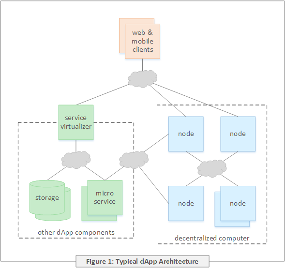

# The Decentralized Computer

The CasperLabs system is a geographically unbounded computer with no single locus of control \("decentralized"ù\), whose operation is determined by consensus among a set of distributed "nodes"ù. This decentralized computer executes functions \("contracts"\) written in general purpose programming languages which may create and access persistent state. The identity and order of contracts to execute, and the persistent results of that execution, are agreed upon by consensus between nodes. Physically, a node is a copy of the node software developed by CasperLabs running on a virtual or physical machine. This system is run by "operators"ù who are compensated for executing contracts consistent with the consensus and penalized for behavior inconsistent with the consensus. All operators in the system may not provide the same level of service. For example: Some operators may supply compute and storage resources while others may only support querying storage.

Applications using the decentralized computer are known as "decentralized apps"ù or "dApps"ù. The architecture of a typical dApp is depicted in Figure 1. dApps implement their desired function by storing and executing contracts on the decentralized computer. In addition to being composed of contracts executed on the decentralized computer, dApps may also be composed of software running elsewhere on the network. In some cases dApp providers will run their own node which in turn will interact with nodes elsewhere on the network.

The nodes composing the decentralized computer are distributed across the Internet and execute concurrently. Thus messages between nodes will experience out of order delivery, variable transmission latency, and failed delivery. Under these conditions any particular node's view of the state of the decentralized computer is eventually consistent with all other nodes. Referring to Figure 2: At any given point in time there will exist some point in the past prior to which all nodes have a mutually consistent view of the state of the system - this is known as the "finalization boundary"ù \(explained in more detail below\). Between the finalization boundary and the present, different nodes may have inconsistent views of the system. A consensus algorithm is used to converge nodes to a consistent view of the state of the decentralized computer.

The overall design of the CasperLabs system is one of multiple inter-dependent concepts and algorithms. This document presents this set of concepts incrementally. A concept may be presented more than once where earlier presentations omit details and, after other dependencies have been introduced, the concept is then revisited.

A note on nomenclature: Hereafter the phrase "node software"ù will refer to the software being developed by CasperLabs; the unadorned word "node" will refer to an instance of "node software"ù run by an operator on a virtual or physical machine. The phrases "the system"ù and "the CasperLabs system"ù are synonymous with "the decentralized computer"ù.

