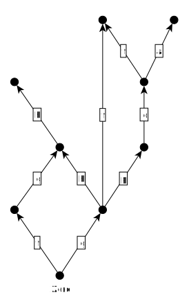
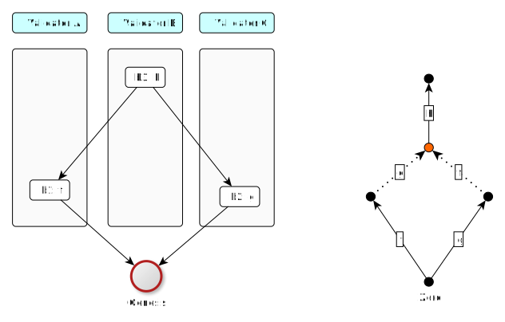
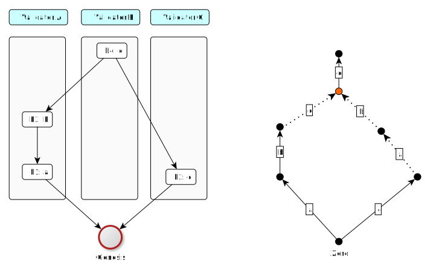
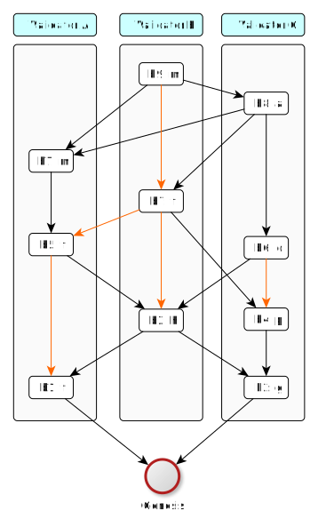
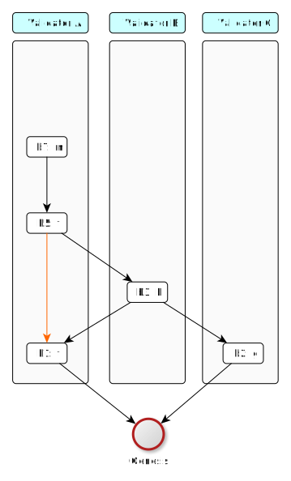

# CBC Casper

## Introduction

A consensus protocol is at the core of any blockchain technology. It dictates how a distributed set of trustless nodes come to a coherent view of the world.

The consensus solution used in CasperLabs blockchain is a latest achievement of research that can be traced back to the 1980's. Important milestones of this process can be identified as:

* 1980: The problem of byzantine consensus defined \(Lamport, Shostak\)
* 1985: Impossibility of distributed consensus with one faulty process theorem \(Fischer, Lynch, Paterson\)
* 1997: Proof-of-Work invented \(Hashcash system\)
* 1999: "Practical Byzantine Fault Tolerance" \(PBFT\) algorithm \(Miguel Castro, Barbara Liskov\)
* 2008: Bitcoin invented \(Satoshi Nakamoto\)
* 2012: First proof-of-stake cryptocurrency system created \(Peercoin system\)
* 2013: Ethereum invented - cryptocurrency idea generalized to a decentralized general-purpose computing platform \(Vitalik Buterin\)
* 2013: "Greedy Heaviest Observed Subtree" \(GHOST\) algorithm introduced \(Sompolinsky, Zohar\)
* 2015: Blockchain idea extended to "block DAG" - "Inclusive Block Chain Protocols" \(Lewenberg, Sompolinsky, Zohar\)
* 2017: First draft version of Casper protocol spec published \(Ethereum research group, Vlad Zamfir\)
* 2018: First implementation of proof-of-stake blockchain built on Casper-GHOST-Blockdag combination attempted \(Rchain system\)
* 2018: Casper protocol 1.0 specification \(Ethereum research group, Vlad Zamfir\)

The solution we present here is pretty complex. Therefore we introduce it step-by-step, starting from the simplest possible model first and then enriching the model gradually. This way a sequence of \(abstract\) models is built, where the understanding developed with every model N is directly utilized in subsequent model N+1.

As our last step we explain how the abstract model actually maps to the our implementation.

## Terms and concepts

We deal with a collection of entities attempting to reach consensus via message passing. These entities are typically referenced in literature as processes, actors, nodes, machines or generals. To be consistent with Casper research tradition, we call them 'validators'.

Technically, validators are going to be computers running a dedicated application, referenced here as "blockchain node". These validators collectively form a peer-to-peer network, using a message-passing based P2P protocol. This is what we aim to describe here.

Conceptually, the validators connected via their P2P consensus protocol form a decentralized computer. This computer has memory \(elsewhere in this white paper referenced as "global state"\) and performs operations \(transactions\) that change the state of this memory.

We use the following terms:

* **global state** - any snapshot of data stored in the shared database we are executing transactions against
* **transaction** - a program that operates on the global state

Below we quickly recall some well-known concepts from mathematics that are used thorough the chapter.

**Sets, functions and logic**

* **iff** - shorthand for "if and only if", so the logical equivalence
* **power set of A** - denoted $$P(A)$$, is the set of all subsets of A
* **cartesian product** $$\mathbf{A \times B}$$ - set of all pairs $$(a \in A, b \in B)$$
* **image and inverse-image** - for a function $$f: A \rightarrow B$$, $$\overrightarrow{f}:P(A) \rightarrow P(B)$$ is a function mapping subsets of $$A$$ to their images via $$f$$, while $$\overleftarrow{f}:P(B) \rightarrow P(A)$$ is a function mapping subsets of B to their inverse-images via $$f$$
* **bijection** - a function that is invertible
* **partial function**  $$\mathbf{f:A \rightarrow B}$$ - function $$A \supset X \rightarrow B$$; we denote by $$dom(f)$$ the domain of $$f$$, so the set of elements in $$A$$ where $$f$$ is defined; so basically $$dom(f)=X$$
* $$\mathbf{f \circ g}$$ - functions composition: $$f \circ g (x) = f(g(x))$$
* $$\mathbf{B^A}$$ - set of all functions $$A \rightarrow B$$
* $$\mathbf{Partial(A \rightarrow B)}$$ - set of all partial functions $$A \rightarrow B$$

**Relations and POSETs**

* **relation on A** - any subset of $$A \times A$$
* **POSET** - partially ordered set; this is a pair $$<A, R>$$, where $$A$$ is a set, $$R$$ is a relation on $$A$$ which is reflexive, antisymmetric and transitive; we write $$a < b$$ when $$(a,b) \in R$$
* **linear order** - a POSET where any two elements a,b are comparable, so either $$a < b$$ or $$b < a$$
* **transitive closure of a relation** - for a relation $$R \subset A \times A$$, a smallest transitive relation $$T \subset A \times A$$ such that $$R \subset T$$
* **transitive reduction of a relation** - for a relation $$R \subset A \times A$$, a smallest relation $$T \subset A \times A$$ such that $$R ⊂ TransitiveClosure(T)$$
* **linear extension of a partial order** - for a POSET $$<A, R>$$ this is any relation $$E$$ on $$A$$ such that $$R \subset E$$ and $$<A, E>$$ is a linear order

**Directed graphs**

* **directed graph** - a structure $$<V,E,source: E \rightarrow V, target: E \rightarrow V >$$, where $$V, E$$ are arbitrary sets; we call elements of $$E$$ - _edges_, and elements of $$V$$ - _vertices_; conceptually we visualize a graph as a collection of dots \(vertices\) connected by arrows \(edges\), where functions $$source$$ and $$target$$ are visualized as, respectively, source and target of every arrow
* **path in a directed graph** - any ordered sequence of edges $$<e_1, ..., e_n \in E^n>$$, such that $$source(e_{i+1})=target(e_i)$$; when talking about paths we use the notation $$p:x \leadsto y$$ which signals that path $$p$$ starts at vertex $$x$$ and ends at vertex $$y$$
* **cycle in a directed graph** - path $$<e_1, ..., e_n \in E^n>$$, where $$source(e_1)=target(e_n)$$
* **directed acyclic graph** \(or just **DAG**\) - directed graph which does not contain cycles
* **simple DAG** - a DAG where any pair of vertices is directly connected by at most one edge; equivalently - $$\forall p,q \in E \space source(p)=source(q) \wedge target(p)=target(q) \Rightarrow p=q$$
* **root** - \(in a DAG\) vertex which is not a target of any edge
* **leaf** - \(in a DAG\) vertex which is not a source of any edge
* **topological sorting of a DAG** - for a DAG $$<V,E>$$ topological sorting is a linear order on vertices such that $$\forall e \in E \space source(e) < target(e)$$

Simple directed graphs and 2-argument relations are in fact two languages for talking about the same thing. Every simple DAG can be seen as a POSET \(by applying transitive closure\). Every POSET can be seen as a simple DAG \(by applying transitive reduction\). Roots in a DAG correspond to minimal elements in a POSET, leaves in a DAG correspond to maximal elements in a POSET. Topological sortings correspond to linear extensions.

## Communication layer assumptions

We assume that the P2P protocol used for validator-to-validator communication is based on best-effort-broadcasting. So, any time a validator $$v$$ has a new message $$M$$ to announce, it is announcing the message to all validators in the network. We assume that, once broadcasted, the message M will be eventually delivered to any other validator $$w$$ in the network that is alive, but:

* the delay between sending $$M$$ and receiving $$M$$ is arbitrary in duration.
* there is no guarantee on message order, so delivery order may differ from broadcast order
* the same message may be delivered more than once
* in principle messages can also get lost, but we expect this is going to be handled by lower layers of communication, so in the consensus layer message loss presents as delays

## Base model: distributed database with DAG of transactions

Our base model describes the set of nodes \(validators\) concurrently updating a shared database.

### Global states

Let $$V$$ denote the \(finite\) set of validators.

Let $$<GS, Zero \in GS>$$ be a set with a distinguished point. We will be calling this set "global states" and the distinguished point will be called "the initial state".

Intuition here is that validators are going to establish a common view on "virtual memory of a decentralized computer" which is just another way of saying "decentralized database". A point $$gs ∈ GS$$ represents a single snapshot of this shared memory.

### Transactions

A **transaction** is any partial function $$t:GS \longrightarrow GS$$. We think of transactions as "programs". Set of all possible partial functions $$Partial(GS \rightarrow GS)$$ corresponds to "all programs one can imagine", while we typically work in a much more restricted environment, where only Turing-computable programs are allowed \(or even less\). We hide all this complexity by just assuming that $$TR \subset Partial(GS \rightarrow GS)$$ contains all transactions \(=programs\) that are available.

**Example 1:** Take global states to be $$<\mathbb{N},0>$$. Example transactions:

* $$f(n)=n / 2$$ \(defined only for even numbers\)
* $$f(n)=n+1$$ \(defined for all numbers\)

**Example 2:** Let $$A=\{Alice, Bob, Charlie\}$$. Take global states to be $$\mathbb{N}^A$$. Intuitively this can be seen as a simple banking system with only 3 accounts, where a global state $$gs:A \rightarrow B$$ tells what are current balances of accounts. Let's define a sample transaction:

$$
f:\mathbb{N}^A \supset \{b \in \mathbb{N}^A:b(Alice)>0\} \rightarrow \mathbb{N}^A \newline
f(b)=\{(Alice, b(Alice) - 1), (Bob, b(Bob)+1), (Charlie, b(Charlie))\} \newline
$$

This is how a program transferring 1 coin from Alice's account to Bob's account looks in our abstract notation.

**Example 3:** Take global states to be any set $$A$$. Take transactions to be all permutations on A: $$TR={f \in A^A: f \space is \space bijection}$$.

**Example 4:** Let $$GS=\{0,1\}$$. Let $$TR=Partial(GS \rightarrow GS)$$ - this set contains 9 elements. This is in a sense a simplest non-trivial states and transactions setup over which our consensus can be tested.

### Transitions

By a **transition**, we mean a pair $$<x,f(x)>$$, where $$f$$ is any transaction. Conceptually, transitions are like arrows connecting global states, while transaction is factory of transitions. Talking about transitions pops up naturally when one wants to visualize evolution of database state showing graphs where states are vertices.

The way we use the word "transaction" is slightly different compared to the "IT tradition". In our lingo, a transaction is conceptually a program. A program can be executed against any input data and in this case the input data is the state of the database \(= global state\). On the other hand, what database community traditionally used to call "transaction", we prefer to call "transition". For example "Alice sends 10 dollars to Bob" or "If last chess game was lost, Alice sends 10 dollars to Bob" are transactions \(= programs\). The program generates a state transition when applied to a specific global state.

### Composing transactions vs composing transitions

Being just functions, transactions naturally compose. We will follow the normal mathematical notation for composing transactions: $$g \circ f$$ gives a transaction which first applies $$f$$, then applies $$g$$. But because transactions are partial functions, composition may shrink the domain: $$dom(g \circ f) \subset dom(f)$$.

In case of transitions, technically they do not compose \(because they are not functions\). But it is convenient to actually introduce composition for transitions as well. Let's consider a sequence of two transitions:

$$
x \xrightarrow{f} y \xrightarrow{g} z
$$

This notation means that the following holds:

1. $$f(x)=y$$
2. transaction $$g$$ is defined at global state $$y$$
3. $$g(y)=z$$

When we have such a sequence, we may define composition of above sequence to give the following result:

$$
x \xrightarrow{g \circ f} z
$$

### From transitions to evolution graphs

For talking about distributed consensus we need to find a convenient notation and convenient communication model. These two somehow go together and we will try to follow the heuristic approach, showing how the idea naturally comes out.

A point in $$GS$$ tells the "current" state of the decentralized database. This points moves after any transaction applied. The trajectory of the point, which can be seen as a sequence of transitions, makes what we call "the evolution". In the world of traditional \(i.e. centralized\) databases such an evolution could look like this:

Above notation actually has a problem. Transaction is a program, and we obviously are allowed to apply the same program more than once, like here:

So far this does not look too bad but in a distributed environment the ability to distinguish between different invocations of the same transaction is crucial. So we will introduce explicit invocation labels:

We will use the word **block** for referencing the piece of data that carries the information about an invocation of a transaction. In the above picture, $$b_1$$ is a block carrying information about the invocation of the transaction $$f$$.

In our decentralized network of validators, different validators will independently try to execute transactions and then announce this to others. Let's assume that each validator tries to follow what happened in the network so far by using the graph built from state transitions. This would look like:

Now, the skeleton of the decentralized database solution looks as follows: validators create and broadcast blocks, every block carrying a single transaction. Every validator \(independently\) tries to capture what happened in the network so far and represents this knowledge \(in his local memory\) as an evolution graph. However, to be able to define a legal way of creating new blocks, we will have to introduce **merging of histories**.

### Understanding conflicts and merging

In general one can imagine a decentralized database solution where, although all validators can propose transactions, the consensus protocol leads to a "canonical" sequential evolution. This is how networks like Bitcoin or Ethereum work. CasperLabs foreeses significant network throughput gains by allowing independent lines of decentralized database evolution to be merged.

To understand this phenomenon on the level of an evolution graph we will start with an example. Let's assume we have 4 validators: Red, Green, Blue, Orange. Let our decentralized database keep accounts and balances. Our $$Zero$$ state of the database is: \[Alice: 8, Bob: 3, Charlie: 3\].

Consider the following transactions:

* $$a$$ - is Alice transferring 5 dollars to Bob
* $$b$$ - is Bob transferring 3 dollars to Charlie
* $$c$$ - is Alice transferring half of her money to Charlie if she has even balance, otherwise do nothing
* $$d$$ - is Charlie transferring 1 dollars to Alice

We will use colors to mark who proposed a block. Let's assume Orange validator came up with the following evolution graph:

The idea of merge-ability goes along the basic intuition: two histories are mergeable if they can be turned into a single history without ambiguity. And we really only understand sequential composition of transactions, so "history" must be something that can be turned into sequential path of transactions.

For example, look at these two blocks:

* block $$b_1$$ \(executing transaction $$a$$\), proposed by Orange
* block $$b_2$$ \(executing transaction $$b$$\), proposed by Red

If merging is all about creating a history that contains both blocks, then we immediately encounter a problem: which order to apply ?

This would be $$b_1$$ first, then $$b_2$$:

This is the other way around:

A crucial observation here is that the final state we are getting is the same in both cases we got \[Alice: 3, Bob: 5, Charlie: 6\]. So the ordering problem is solved easily by the fact that ordering of composition does not matter. This is exactly what we mean by "turning two histories into a single history without ambiguity".

Now, let's try another pair: $$b_1$$ with $$b_3$$. Both blocks execute the same transaction $$a$$, but of course these are separate invocations, so in the merged history, transaction $$a$$ would have to be executed twice. Let's see how this looks like:

It does not work at all! Second execution of transaction $$a$$ just fails, so this is not a valid transition. And we can easily see why - it would make the balance of Alice's account negative, which is not allowed in our model. Formally, we say that the global state \[Alice: 3, Bob:8, Charlie:3\] does not belong to the domain of the partial function $$a$$. So we conclude that these two histories are NOT mergeable.

Let's try yet another pair $$b_4$$ and $$b_5$$. Now the situation is a little more complex because we have to compare $$b_2 \leadsto b_5$$ path vs single element path $$b_4$$ and the problem of "possible orderings" of the sequence becomes more tricky. When we loop over possible sequential histories, we have to respect already existing causal structure. Because $$b_2$$ precedes $$b_5$$, we will only do composing along sequences of $$b_2$$, $$b_4$$ and $$b_5$$ that respect this condition. It leads to 3 possibilities:

In all 3 cases compositions are well defined but the final state we end up with is not always the same. This is a conflict - merging is not possible.

Let's assume that Orange decided to merge $$b_1$$ and $$b_2$$ \(now we now they are mergeable\) and extend the merged history by executing transaction $$b$$.

It looks good but now we can see that out notation is slightly too verbose and turns out to be less convenient then initially expected. There are two issues:

* When we are not really interested in showing "contents" of the state, but only dependencies of blocks, this notation is too verbose.
* When merging, it is not clear how to label edges. Should we encapsulate transactions $$a$$ and $$b$$ leading to the "merged" state into separate blocks or not ?

This issue leads to a better notation that we introduce in next chapter.

### Blockdag

A **blockdag** is a directed acyclic graph made of blocks.

A **block** is either a special Genesis block or a tuple consisting of:

* a validator
* a transaction
* a finite non-empty list of parent blocks

As the above type is recursive, to reconstruct the same idea formally, we need to define it by induction:

$$
Blocks_0 = {Genesis} \newline
Blocks_n = \{ <creator , transaction, parents>: creator \in V, \newline transaction \in TR, parents \subset Blocks_{n-1}> \} \newline
Blocks = \bigcup\limits_{i=1}^{\infty} Blocks_i
$$

Having any collection of blocks $$\mathfrak{B} \subset Blocks$$, we consider it being a directed acyclic graph by taking:

* vertices are blocks, plus one "special" vertex called Genesis
* edge $$A \longrightarrow B$$ exists iff block B is included in the collection of parents as specified in A

We consider a blockdag $$\mathfrak{B}$$ to be well formed if:

* it contains Genesis
* if a block $$b$$ is in $$\mathfrak{B}$$ then parents of $$b$$ are also in $$\mathfrak{B}$$
* for every block $$b \in \mathfrak{B}$$ there exists a path $$b \leadsto Genesis$$ in $$\mathfrak{B}$$

This is an example of a well-formed blockdag:

We use the following conventions to visually represent blockdags:

* block label $$b6: f$$ tells the identity of the block is $$b_6$$ and transaction it executed is $$f$$
* vertical swimlanes correspond to validators; block is displayed in a swimlane of its creator
* every block is a source of one of more arrows and this way we represent block's parents
* graph is displayed following the topological sorting, so arrows always are directed downwards and over time the structure grows upwards

Considered a DAG, blockdag has always a single leaf - Genesis - but usually many roots. There is a tradition to use the word **tips** when talking about the roots of a blockdag.

### Digression: blocks identity and hash

Of course we are trying to make a good balance between precision \(given by mathematical description of the solution\) and programmer's intuition \(which goes much closer along the actual implementation details\). These two perspectives are sometimes quite different. And one such thing is block hash.

On the mathematical side, we start with the space of global states $$GS$$, then we have the set $$TR$$ of transactions over $$GS$$, then we have the set of blocks over $$TR$$. As all this is formally based on first-order logic and set theory, the identity of blocks comes for free. Also they are immutable for free. The only thing we will need, that is still missing, is the total ordering on the set of blocks, but because every set can be well-ordered \(Zermelo's theorem\) we can fix any such ordering and just use it.

On the implementation side, the same set of goals is addressed in quite different way. Blocks are going to be pieces of data \(so, encoded as byte arrays\) exchanged between nodes. For having identity and immutability that cannot be tampered, we have digest functions and public-key cryptography. A side effect of this is that each block must include a digest \(=hash\) or its body and this hash can be used as block id. Also, this hash gives us a total ordering of blocks by lexicographic sorting of hashes. In this approach we of course ignore the fact, that collisions of hashes exist - by naive assumption that such a collision will never happen in practice.

Whenever we mention that some structure contains blocks, this "contains" must be properly understood. On the mathematical side, sets are "pointers" based - every object can be an element of many sets. while the object it still the same. On the implementation side such pointers frequently depend on the context or representation or the object and block hash playing the role of universally unique reference is a nice example. Said that, we are not very diligent mapping mathematical notation to implementation-level concepts. We generally assume this is obvious enough.

### Blockdags vs evolution graphs

Before we completely drop evolution graphs notation if favor of blockdags, it is worth looking how these two correspond. For example, this is a simple sequential evolution with 3 validators involved:

With blockdag in place we have now a clear narration of the chronology of events in our network of validators:

1. Validator C proposed block $$b_1$$ by executing transaction $$f$$ on top of state Zero.
2. Validator B proposed block $$b_2$$ by building on top of block $$b_1$$ and executing transaction $$g$$.
3. Validator A proposed block $$b_3$$ by building on top of block $$b_2$$ and executing transaction $$h$$.

Let's see how this will look when merging comes into play:

Let's again translate events to plain English:

1. Validators A and C independently proposed blocks $$b_1$$ and $$b_2$$. Block $$b_1$$ was executing transaction $$f$$. Block $$b_2$$ was executing transaction $$g$$.
2. Validator B discovered that blocks b1 and b2 are mergeable, so he proposed block b3 by merging b1 and b2 and executing transaction $$h$$ on top of it.

Please observe \(see the red dot\) how the intermediate state $$f(g(Zero)) = g(f(Zero))$$ is hidden from the picture on the left and its existence is just implicitly given by fact that block $$b_3$$ has more than one parent.

To better illustrate the transformation from a blockdag to the corresponding evolution graph, here is slightly more complex example:

Finally, we can come back to the example with Alice-Bob-Charlie sending money, and convert also this one the a blockdag. This was the evolution graph:

And this is how it looks after translating to blockdag notation:

### Formal definition of merging

We are now ready to define merging formally. We will do this by extending the list of conditions for a blockdag to be well formed. First we need a convenient way of talking about paths in a blockdag.

For two blocks $$a,b \in \mathfrak{B}$$ we say that $$b$$ builds on $$a$$ \($$a \triangleleft b$$\) when there exists a non-empty path in $$\mathfrak{B}$$ from $$b$$ to $$a$$.

For a block $$b \in \mathfrak{B}$$ we define **p-past-cone** as:

$$
pPastCone(b)=\{x \in \mathfrak{B}:  x=b \lor x \triangleleft b\}
$$

Because p-past-cone of a block is a subset of vertices of a blockdag, it inherits the acyclic directed graph structure and so itself is a blockdag.

For any finite sequence of blocks $$<b_1,...,b_n>$$ we can consider a corresponding sequence of transitions, by starting from global state $$Zero$$ and sequentially applying transactions $$b_i.transaction$$. This path of transitions may or may not be composable \(because transactions are partial functions\). In case the composition is possible, **composition of a sequence of blocks** is the result of composing transitions.

Any linear order on a finite set of blocks may be seen as a finite sequence of blocks. If $$G$$ is a set of blocks and $$<G,R>$$ is a linear order then corresponding composition of a sequence od blocks we will call **composition of G along R**.

For any directed acyclic graph $$G=<V,E>$$ by $$TopSort(G)$$ we denote the collection of all topological sortings of $$G$$. So elements of $$TopSort(G)$$ are linear orders.

To capture merging correctness we require that a well-formed blockdag $$\mathfrak{B}$$ must fulfill the following condition:

For every block $$b \in \mathfrak{B}$$ there exists a global state $$gs \in GS$$ such that for any linear order $$ts \in TopSort(pPastCone(b))$$, $$ts^{-1}$$ must give a composable sequence of blocks and composition of $$pPastCone(b)$$ along $$ts^{-1}$$ must have destination $$gs$$.

Caution: We need to use the inverted relation $$ts^{-1}$$ because direction arrows in the blockdag is opposite to the direction of underlying transactions.

In the distributed consensus protocol we are going to define, crucial is the ability to tell whether given set of tips is **mergeable**. This concept is directly compatible with merging intuitions we built in previous chapters but now we want to be precise and base it on the formal definition of well-formed blockdag. Intuition is that blocks $$b_1,b_2 \in \mathfrak{B}$$ are mergeable if after adding a block that will have $$b_1$$ and $$b_2$$ as parents $$\mathfrak{B}$$ is still going to be well-formed. But this extra block may contain a transaction and this makes the intuitions less clear \(we would have to enforce the new block to contain the identity transaction\), so for clarity we take a slightly more elementary approach.

First, we need to generalize past cone concept to handle a collection of blocks:

For a finite set of blocks $$M = \{b_1, ..., b_n\}, b_i \in \mathfrak{B}$$ we define $$pPast\(M\) = \bigcup\limits\_{i=1}^{n} pPastCone\(b\_i\).

Then we define mergeability. We say that a set of blocks $$M = \{b_1, ..., b_n\}, b_i \in \mathfrak{B}$$ is **mergeable** if there exists a global state $$gs \in GS$$ such that for any linear order $$ts \in TopSort(pPast(M))$$, $$ts^{-1}$$ must give a composable sequence of blocks and composition of $$pPast(M)$$ along $$ts^{-1}$$ must have destination $$gs$$.

Both definitions of merging are related by the following:

**Theorem:** in a well-formed blockdag $$\mathfrak(B)$$, for any block $$b \in \mathfrak(B)$$ if $$b$$ has more than one parent then collection $$b.parents$$ is mergeable.

### Adding causal structure to the blockdag

Blockdags as defined so far look like an appealing data structure for our shared database consensus implementation. Unfortunately they miss something important: time. To understand why this is a problem, let's look at the following blockdag:

Blocks created by validator $$B$$ form a tree and the tree has more then one leaf. Namely - both block $$b_9$$ and block $$b_{10}$$ look "last" and by just looking at the blockdag there is no information on the preference that validator B has in regards to the history of the shared database that he would like to be accepted by others.

We could enrich our model in many different ways for such preference to be available. For example every validator could keep a counter of created blocks and at the moment of creating a new block - seal a subsequent number into the block. This way other validators could assume that blocks with the highest number corresponds to the most recent preference of the creator. Another possible solution would be to use [Lamport synchronization](https://en.wikipedia.org/wiki/Lamport_timestamps) for establishing the concept of global clock and seal timestamps derived from this global clock into blocks.

One of findings of Casper protocol research was a convenient solution to this problem. Instead of introducing timestamps and clocks, we are going to use a whole copy of the blockdag as a "timestamp" and seal it into the block !

Well, but if we require each block $$B$$ created by validator $$V$$ to contain a snapshot of a blockdag maintained by $$V$$ at the moment of creating $$B$$, are these blocks going to become large and keep growing forever? This immediately looks like a major performance problem. The issue address by evolving the blockdag only by appending new blocks. If every block can point to blocks seen at its creation - we will call these pointers **justifications** - then we can just use reduce the required collection of pointers to just roots of the blockdag's snapshot.

Augmenting the definition of a block to capture this concept. A **block** is a tuple consisting of:

* a validator
* a transaction
* a finite non-empty set of justification blocks
* a finite non-empty set of parent blocks \(subset of justifications\)

Formally:

$$
Blocks_0 = {Genesis} \newline
Blocks_n = \{ <creator , transaction, justifications, parents>: \newline
 creator \in V, transaction \in TR, justifications \subset Blocks_{n-1}, \newline
 parents \subset justifications> \} \newline
Blocks = \bigcup\limits_{i=1}^{\infty} Blocks_i
$$

In layman terms, when I am a validator, on creating a new block $$B$$ I am sealing into the block two sets of links:

* justifications - and they say "look, this was my snapshot of the blockdag when I was creating block $$B$$"
* parents - and they encode the decision on "which paths of shared database evolution I am merging with block $$B$$"

So, now we also have to update the definition of **blockdag**: a blockdag is a set of blocks closed to taking parents and justifications \(which implies that a blockdag must contain Genesis\).

Both parent-child and justifications links form directed acyclic graphs. They share the same set of vertices, only justification graph has possibly more edges. So, now within a single blockdag we have two directed acyclic graphs:

* $$pDAG$$: where arrows are from a block to its justification
* $$jDAG$$: where arrows are from a block to its parent

And we have an inclusion: $$pDAG \subset jDAG$$.

To visually reflect the enriched structure we have to adjust the way we draw blockdags.

This new drawing convention is:

* Black arrows are from $$pDAG$$.
* Red arrows are from $$jDAG \setminus pDAG$$.
* We do not draw redundant red arrows \(so when a red arrow can be deduced as pats of red-or-block arrows\).

The way we use blockdags unfortunately makes classic terminology of DAGs confusing while talking about mutual position of vertices. Classic approach is that if there is a path $$v \rightarrow ... \rightarrow w$$, we say that $$v$$ precedes $$w$$, or that $$v$$ is an ancestor of $$w$$. Frequently it is also denoted by $$v \prec w$$, especially if we talk about a simple DAG, so the one effectively equivalent to a POSET. The source of confusion is coming from how our blockdags grow. Arrows in blockdags point always towards the "past" and latest blocks are always roots. This way "time-precedes" in direct semantic collision with "arrow-precedes". To evade the confusion we introduce the following terms:

* $$b$$ builds on $$a$$, or $$a \triangleleft b$$ when there exists a path in $$pDAG$$ from $$b$$ to $$a$$
* $$b$$ requires $$a$$, or $$a \ll b$$ when there exists a path in $$jDAG$$ from $$b$$ to $$a$$

This way relational operators $$\triangleleft$$ and $$\ll$$ are coherent with time intuition:

* $$b$$ builds on $$a$$ implies that $$a$$ is older than $$b$$ \(= was added later to the blockdag\)
* $$b$$ requires $$a$$ as well implies that $$a$$ is older than $$b$$ \(= was added later to the blockdag\)

Also, the "leaves" and "roots" terminology coming from DAGs is not quite coherent with the time passing intuition. Technically, we have only one leaf - Genesis - but roots are what was added lately. Plus, we always have to distinguish $$pDAG$$ from $$jDAG$$ ! Therefore we prefer to use these these terms:

* **p-tips**: roots of $$pDAG$$
* **j-tips**: roots of $$jDAG$$

Last but not least we introduce **cones**. This terminology is actually borrowed from Einstein's Special Relativity theory, namely from the Minkowski spacetime diagrams:

We already introduced p-past-cone before, now we are adding all sibling definitions as well. For a block $$b \in \mathfrak{B}$$:

* **p-past-cone** - for a block $$pPastCone(b)=\{x \in \mathfrak{B}:  x=b \lor x \triangleleft b\}$$
* **p-future-cone** - for a block $$pFutureCone(b)=\{x \in \mathfrak{B}:  x=b \lor b \triangleleft x\}$$
* **j-past-cone** - for a block $$pPastCone(b)=\{x \in \mathfrak{B}:  x=b \lor x \ll b\}$$
* **j-future-cone** - for a block $$pPastCone(b)=\{x \in \mathfrak{B}:  x=b \lor b \ll x\}$$

### Implementation of a decentralized database

We are now prepared enough to introduce the distributed-consensus based implementation of a decentralized database.

During his lifetime, a validator $$v$$ maintains two collections:

* **blockdag** with all blocks either produced by $$v$$ or received from other validators
* **blocks-buffer**: a buffer of blocks received, but not yet incorporated into blockdag

A block $$b$$ can only be added to the blockdag if all justifications of $$b$$ were collected and added before $$b$$. So if a validator receives a block before receiving some of its justifications, the received block must wait in the buffer.

Every validator $$v$$ is concurrently executing two infinite loops of processing:

Publishing loop:

1. Select a transaction $$t ∈ TR$$ to be executed as the next one \(we here say nothing on how this selection happens but intuition is of course that these transactions come from the business context - most likely from clients sending requests\).
2. Run **fork choice**, i.e. select a subset $$p$$ of  blockdag vertices \(to be used as parents of the new block\).
3. Create a new block $$b = <creator = v, transaction = t, parents = p, justifications = jtips(blockdag)>$$.
4. Add $$b$$ to the blockdag.
5. Broadcast $$b$$ to all validators in the network.

Listening loop:

1. Listen to blocks incoming from other validators.
2. When a block $$b$$ arrived: check if all justifications of b are already included in the blockdag.
   * if yes: append $$b$$ to blockdag
   * else: append $$b$$ to blocks-buffer.
3. Validate whether parents of block $$b$$ were selected correctly by running fork-choice from the perspective of $$b.creator$$ \(using justifications in $$b$$ to re-create the snapshot of the blockdag as seen by $$b.creator$$\).
4. If the validation in step \(3\) failed, discard $$b$$ and restore blockdag to the state before running step \(2\).
5. Check if any block in blocks-buffer can now leave the buffer and be included in the blockdag, because all its justifications are now in blockdag.
6. Repeat step 3 as many times as needed.

How parents of a new block are selected \(publishing loop, step 2\) is the most critical point of the whole distributed consensus. We call this the **fork choice rule** and the subsequent sub-chapters are centered around this topic.

### Equivocation

When we again take a look at the example blockdag, every swimlane \(considered a subgraph of $$jDAG$$\) is a chain:

This is not surprising because, logically, as a valdiator, when I propose a new block, all blocks I proposed so far are within the scope of my knowledge, so obviously I am including them in justifications of a new block, when I create it. At least I **should** do so. The problem is that in a network of validators such "honest" behaviour cannot be technically enforced. Instead, we have to accept that the reality will sometimes look like this:

In this example, validator $$A$$ violates the "honesty" rule by splitting his chain at block $$b_5$$. Both $$b_8$$ and $$b_9$$ are referencing $$b_5$$ and yet there are not visible to each-other via justifications. This looks like validator $$A$$ is not aware of his own blocks he proposed! This is called an **equivocation**.

How such a situation can happen and still be "formally legal" ? Well, it is enough that a malicious validator decides to broadcast new blocks selectively, so in this case $$b_9$$ is published to one subset of the network while $$b_8$$ to another part. Eventually block propagation will cause validators to discover that $$A$$ was equivocating at some point, but this discovery will take time and by that time both blocks will play their role in what happened later.

Caution: Equivocation is a phenomenon that decreases efficiency of consensus, in the extreme case leading to no consensus. We address this problem later by introducing economical incentives, so that validators normally don't equivocate. Nevertheless, equivocations may be present in a blockdag, so any algorithm operating on blockdags must take this into account.

### Fork choice phase 1: picking latest blocks

We start fork-choice by finding the latest block in every swimlane. This is easy for honest validators, because their swimlanes are just chains, so there is always at most one j-tip in the swimlane \(the corner case being the empty swimlane, so before the validator proposed his first block\).

Now, let's focus on the other case, so when a validator $$v$$ is actually equivocating. We somehow have to pick one of his j-tips. The rule here is:

1. Select the one with the biggest p-height.
2. If there is more than one, we use the global ordering on blocks - see [here](cbc-casper.md#digression-blocks-identity-and-hash) - to pick a lowest one \(so, implementation-wise, the one with smallest hash\).

This is how it worked for our last example \(latest blocks marked with green\):

Notice how for validator A we preferred block $$b_{10}$$ over $$b_8$$ because $$pHeight(b_{10})=5$$ and $$pHeight(b_8)=4$$.

### Fork choice phase 2: scoring

Scoring is a way of assigning an integer value to every block in the blockdag.

Let $$LastBlocks(blockdag)$$ denote the set of blocks chosen by the above algorithm. This is how scoring works:

$$
Score(block) = \{tip \in LastBlocks(blockdag): block \triangleleft tip \}
$$

The results of running the scoring phase look like this:

### Fork choice phase 3: ordering tips

The goal of this phase is to construct an ordered list of parent candidates. We proceed in a loop, building an ordered collection of blocks, $$T$$:

1. Initialize the collection with just one element: T = $$[Genesis]$$.
2. For each block $$b \in T$$, if $$b$$ has no children - leave $$b$$ as is, otherwise replace $$b$$ with its children sorted by the following multi-level comparator:
   * higher score goes first
   * if scores are equal - smallest block go first \(using total ordering on blocks - see [here](cbc-casper.md#digression-blocks-identity-and-hash)\)
3. For all $$b \in T$$: if $$b$$ is duplicated \(= occurs more than once in the collection\), leave only the leftmost occurence of $$b$$, removing others.
4. Repeat 2-3 until $$T$$ no longer changes with each iteration \(i.e. no block has any children\).
5. $$T$$ is the sorted list of parent candidates.

Let's see how this algorithm works for our example blockdag:

| **Step executed** | **Resulting contents of the collection** |
| :--- | :--- |
| initial | Genesis |
| replace with children | b1,b2 |
| replace with children | b3,b3,b4 |
| remove duplicates | b3,b4 |
| replace with children | b5,b6,b7 |
| replace with children | b8,b9,b12 |
| replace with children | b12,b11,b10,b11 |
| remove duplicates | b12,b11,b10 |
| replace with children | b11,b11,b10 |
| remove duplicates | b11,b10 |

The result we got is a collection of all tips of p-DAG, ordered by "preference". First element is the most preferred one, the **fork-choice leader**.

### Fork choice phase 4: picking biggest mergeable subset of tips

The goal is to find biggest set of p-DAG tips that is mergeable. In case of conflicts we favor blocks with higher priority, where priorities \(were established in phase 3\). This is the algorithm:

1. Initialize results set $$R$$ with just one element - the fork choice leader.
2. For each element $$b$$ in tips collection $$Tips$$ \(obtained in phase 3\), starting from second element:
   * if $$R \cup \{b\}$$ is mergeable, append $$b$$ to $$R$$

### Fork choice freedom discussion

Interestingly, a validator has some freedom in the way he runs fork choice. Although the fork-choice algorithm is fully deterministic when run against a fixed blockdag, the actual selection of the blockdag that fork-choice is run against, is something that can be considered part of validator's strategy. To understand this, let's look again at the first example of a blockdag with justifications:

Let's pretend I am the validator $$A$$ and I am just about to propose a new block - $$b_{11}$$. My last block was $$b_8$$ and its j-past-cone is what represents the snapshot of the blockdag that was included with the block. So, as of now, this is what other validators can see as my current knowledge:

For simplifying the discussion, we will introduce two terms, referencing to subsets of local copy of the blockdag as stored by a validator :

* **display** - is the subset of X's local blockdag that other validators can infer as known to X, assuming the source of knowledge being only blocks published by $$X$$; this obviously is the sum of j-past-cones of all blocks published by $$X$$; if $$X$$ is not equivocating, then display of $$X$$ is just equal to j-past-cone of $$X$$'s latest block.
* **pocket** - local blockdag minus the display

On blockdag diagrams, we will be marking the display using violet color.

Now let's come back to the discussion. By the time I published block $$b_8$$ my local blockdag has grown because - apparently - several new blocks from validators $$B$$ and $$C$$ have arrived. Now, which part of my local blockdag am I going to display? This is something that I can make an arbitrary decision about.

For example, I can decide to keep my display minimal. So I deliberately keep $$b_4$$, $$b_6$$, $$b_7$$, $$b_9$$, $$b_{10}$$ in the pocket and I am running the fork-choice against j-past-cone of block $$b_8$$ only. Obviously, $$b_8$$ will become my fork-choice leader and I will publish the new block $$b_{11}$$ having only one parent.

The same blockdag but with display and pocket explicitly marked::

Another example would be to make the display equal to the local blockdag, so in other words to disclose everything. Then, $$b_{10}$$ becomes the fork-choice leader and the situation after publishing my new block will be:

But I also have several "intermediate" possibilities. For example I can keep blocks $$b_9$$ and $$b_{10}$$ hidden, but display everything else. In such case I am running my fork choice against this blockdag:

Fork choice will give $$b_6$$ or $$b_8$$ as the leader \(depending on block hashes\), but it follows from the existence of block $$b_9$$ that all 3 tips are mergeable here. So the final result will be:

Why may a validator be interested in keeping the pocket non-empty ? Well, because this leaves bigger decision space when it comes to publish a new block. This decision space may be seen as some extra power to influence the direction of where consensus is going to. Look at this block $$b_{11}$$ - it contains transaction $$x$$. If transaction $$x$$ is in conflict with transaction $$m$$, so blocks $$b_{10}$$ and $$b_{11}$$ are not mergeable, then publishing $$b_{11}$$ on top of $$b_10$$ is not possible. On the other hand, hiding some blocks from the display makes publishing $$b_{11}$$ legal. Doing so means that validator $$A$$ actively tries tries to influence the direction of where consensus will go, instead of just "going with the flow".

As we cannot stop this phenomenon, the only solution left is just to accept its existence and understand its consequences for the network.

## Increment 1: dynamic set of validators

UNDER CONSTRUCTION

## Increment 2: multi-transactional blocks

UNDER CONSTRUCTION

## Increment 3: transaction fees

UNDER CONSTRUCTION

## Increment 4: proof-of-stake

UNDER CONSTRUCTION

## Finality

UNDER CONSTRUCTION

