# CBC Casper

## Introduction

Consensus protocol stays in the core of any blockchain technology. It dictates how a distributed set of cooperating nodes comes to a coherent view of the world.

The consensus solution used in Casperlabs blockchain is an effect of a long-running research. Critical milestones of this research can be identified as:

* 1980: Lamport / Shostak - the problem of byzantine consensus defined
* 1985: FLP impossibility theorem
* 1997: Proof-of-work invented (Hashcash)
* 2008: Bitcoin invented by Satoshi Nakamoto
* 2013: Bitcoin idea generalized to a decentralized general-purpose computing platform (Ethereum, Vitalik Buterin)
* 2018: Casper protocol research group released version 1.0 of the specification

The solution we present here is pretty complex. Therefore we introduce it step-by-step, by starting from a very simple model first and then enriching the model gradually. This way a sequence of (abstract) models is built, where the understanding developed with every model N is directly utilized in subsequent model N+1.

As our last step we explain how the abstract model actually maps to the real implementation.

## Terms and concepts

We deal with a collection of entities attempting to reach consensus via message passing. These entities are typically referenced in literature as processes, actors, nodes, machines or generals. To be consistent with Casper research tradition, we call them 'validators'.

Technically, validators are going to be computers running a dedicated application, referenced here as "blockchain node", and these validators collectively form a peer-to-peer network, where the message-passing based P2P protocol they use is what we aim to describe here.

Conceptually, validators connected with their P2P consensus protocol form a decentralized computer. This computer has memory (elsewhere in this white paper referenced as "global state") and performs operations (transactions) that change the state of this memory.

We use the following terms:

* **global state** - any snapshot of data stored in the shared database we are executing transactions against
* **transaction** - a program that operates on the global state

We also use the following well-known concepts from mathematics:

* **iff** - shortcut for "if and only if"; frequently used to connect a name of the concept from its definition
* $\mathbf{f \circ g}$ - functions composition: $$f \circ g (x) = f(g(x))$$
* **directed graph** - a structure $$<V,E,source: E \rightarrow V, target: E \rightarrow V >$$, where $$V, E$$ are arbitrary sets; we call elements of $$E$$ - *edges*, and elements of $$V$$ - *vertices*; conceptually we visualize a graph as a collection of dots (vertices) connected by arrows (edges), where functions $$source$$ and $$target$$ are visualized as, respectively, source and target of every arrow
* **path in a directed graph** - any ordered sequence of edges $$<e_1, ..., e_n \in E^n>$$, such that $$source(e_{i+1})=target(e_i)$$
* **cycle in a directed graph** - path $$<e_1, ..., e_n \in E^n>$$, where $$source(e_1)=target(e_n)$$
* **directed acyclic graph** (or just **DAG**) - directed graph which does not contain cycles
* **simple DAG** - a DAG where any pair of vertices is directly connected by at most one edge
* **POSET** - partially ordered set; this is a pair $$<A, R>$$, where $$A$$ is a set, $$R$$ is a relation on $$A$$ which is reflexive, antisymmetric and transitive
* **transitive closure of a relation** - for a relation $$R \subset A \times A$$, a smallest transitive relation $$T \subset A \times A$$ such that $$R \subset A$$
* **transitive reduction of a relation** - for a relation $$R \subset A \times A$$, a smallest relation $$T \subset A \times A$$ such that $$TransitiveClosure(T) ⊂ R$$

Simple directed graphs and 2-argument relations are if fact two languages for talking about the same thing. Every simple DAG can be seen as a POSET (by taking a transitive closure). Every POSET can be seen as a simple DAG (by taking a transitive reduction).

## Communication layer assumptions

We assume that P2P protocol using for validator-to-validator communication is based on best-effort-broadcasting. So, any time a Validator V has a new message M to announce, it is announcing the message to every other validator. We assume that, once broadcasted, the message M will be eventually delivered to any other validator W in the network that is alive, but:

* the delay between sending and receiving is arbitrary long
* there is no guarantee on messages ordering, so delivered order may differ from broadcasting order
* messages may get duplicated
* in principle messages can also get lost, but we expect this is going to be masked by lower layers of communication, so on in the consensus layer this is just masked by arbitrary delays

## Base model: distributed database with DAG of transactions

Our base model describes the set of nodes (validators) concurrently updating a shared database (global state).

### Validators

Let $$V$$ denote the (finite) set of validators.

### Global state

Let $$GS$$ denote the set of global states. So, every point $$gs ∈ GS$$ is just a complete state of a database.

For example in relational databases every $$gs \in GS$$ is a snapshot of data we are storing (collection of tables plus for every table a collection of records it contains). In Casperlabs blockchain such a global state is going to be a dictionary data structure, where allowed keys and values are specific values (LINK HERE). In a more Turing-machine style example one could consider a state which is a function: $$gs:\mathbb{N} \rightarrow \{0,1\}$$.

In the base model we are actually abstracting away from the actual definition of $$GS$$. For us it is enough to say that it is just arbitrary set.

### Transactions

A transaction is any function $$t:GS \longrightarrow GS$$. Set of all possible transactions $$TR=GS^{GS}$$.

We say that two transactions $$t_1, t_2$$ commute on global state $$gs ∈ GS$$ iff $$t_1 \circ t_2 (gs) = t_2 \circ t_1 (gs)$$.

### Evolution graph

We assume that the "history of the world" starts with a specific global state: $$Zero ∈ GS$$. Presumably this is the "empty database" state. Evolution of the database happens as application of transactions to global states.

In the world of classical ACID databases, transactions are applied sequentially to the state of a database.

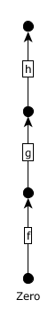

Such pictures can be generalized to a parallel evolution of the database state.

Formally: an **evolution graph** is any directed acyclic graph where:
* vertices are labelled with global states
* edges are labelled with transactions
* having an edge $$x - (f) \rightarrow y$$ , we have $$y = f(y)$$, where $$x,y ∈ GS$$, $$f ∈ TR$$
* every path can be extended to a path starting from Zero.

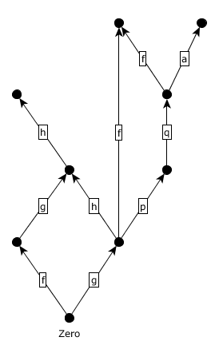

On such diagram, the same transaction may of course appear several times. When there is more than one path connecting two verices, this implies an equation.

For example, reading above evoluton graph we can deduce that:

$f (g(Zero))= g(f(Zero)$

$f(g(Zero)) = f(q(p(g(Zero)))$

### Double spend problem and merging

In our decentralized network of validators, different validators will independently try to propose transactions. Sometimes such propositions are inherently inconsistent, while in other cases they will be mergable.

To understand this phenomenon on the level of evolution graph.

For example let's assume our database keeps accounts and balances. Our initial state of the database is: [Alice: 10, Bob: 0, Charlie: 0].

Consider the following transactions:
* $$a$$ - is Alice transferring 6 dollars to Bob
* $$b$$ - is Alice transferring 7 dollars to Charlie
* $$c$$ - is Alice transferring 4 dollars to Charlie
* $$d$$ - is Charlie transferring 4 dollars to Bob

Our intuition is that $$a$$ and $$b$$ cannot happen together - Alice does not have enough money. On the other hand $$a$$ and $$c$$ look totally mergable and so is the case for $$a$$ and $$c$$. In case of $$b$$ and $$d$$ the situation is unclear, because $$d$$ followed by $$b$$ makes sense, while the other way around looks impossible.

The correct law is actually easy to discover. Let's define the following concept:
* **transactions f and g commute at global state gs** - $$f \circ g (gs) = g \circ f (gs)$$

If transactions to not commute, we say they are conflicting. Please notice that this all works relatively to a point in the space of all global states - two transactions may commute at some points, while they are conflicting at others.

On the evolution graph below, there are two places where merging of commutative transactions can happen - we market both mergable pairs with colors.

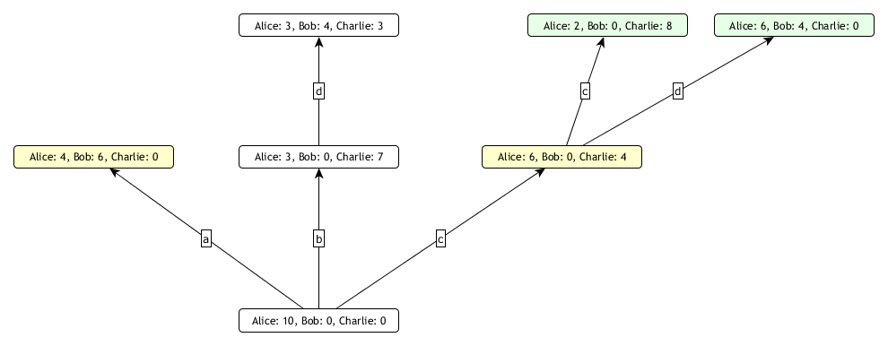

Transactions $$a$$ and $$b$$ commute on global state [Alice: 10, Bob: 0, Charlie: 0]. Transactions $$c$$ and $$d$$ commute on global state [Alice: 6, Bob: 0, Charlie 4].

Let's see how the evolutioin graph will look after these two mergings are appended:

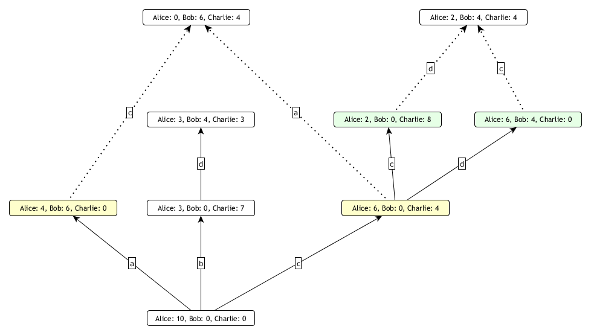

Merging can be seen as an operation that picks two global states in an evolution graph and - if relevant paths commute - extends the evolution graph by adding new state that materializes the commutativity.

### Blocks and blockdags

The evolution graph alone is a not sufficient to implement a distributed consensus - we need a richer data structure for this purpose. If I am a validator, I have to maintain data structures that will provide to me at least the ability to record:

  * transactions I applied so far to the database 
  * my knowledge about other validators' activity 

For this purpose we introduce a dedicated data structure. A **blockdag** is a directed acyclic graph made of blocks.

A **block** is a tuple consisting of:

  * a validator
  * a transaction
  * a finite non-empty list of parent blocks

$$
B = <creator , transaction: GS ⟶ GS, parents = <b_1, ..., b_n>>
$$

Remark: as long as we are in set theory, a set of all possible blocks must be defined using well-founded induction. We skip this technical detail in hope that intuitively the concept is clear enough.

Having a collection of block, we consider it being a directed acyclic graph by taking:
 * vertices are blocks, plus one "special" vertex called Genesis
 * edge $$A \longrightarrow B$$ exists iff block A contains B on the list of parents

We require that in a blockdag every block can be connected by a path with Genesis.

This is an example of a blockdag:

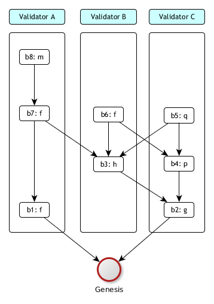

We use the following conventions to visually represent blockdags:

* block label $$b6: f$$ means that this is block $$b6$$ and it stores information about execution transaction $$f$$
* vertical swimlines correspond to validators; block is displayed in a swimline of its creator
* every block is a source of one of more arrows and this way we represent block's parents
* graph is displayed following the topological sorting, so arrows always are directed downwards and over time the structure grows upwards

### Blockdags vs evolution graphs

Blockdag is really just a smart notation for evolution graphs, with "creator" concept added. Smart means here that we keep global states implicit and we encode mergable pairs by the parents concept.

The correspondence of sequencial case is as follows:

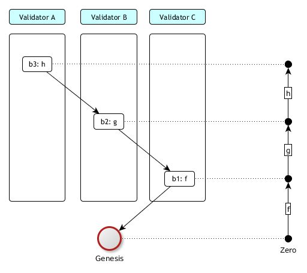

With blocdag we have now the perfectly clear narration of chronology of events in our network of validators:

1. Validator C proposed block $$b_1$$ by executing transaction $$f$$ on top of state Zero.
2. Validator B proposed block $$b_2$$ by building on top of block $$b_1$$ and executing transaction $$g$$.
2. Validator A proposed block $$b_3$$ by building on top of block $$b_2$$ and executing transaction $$h$$.

Let's see how this will look when merging comes into play:

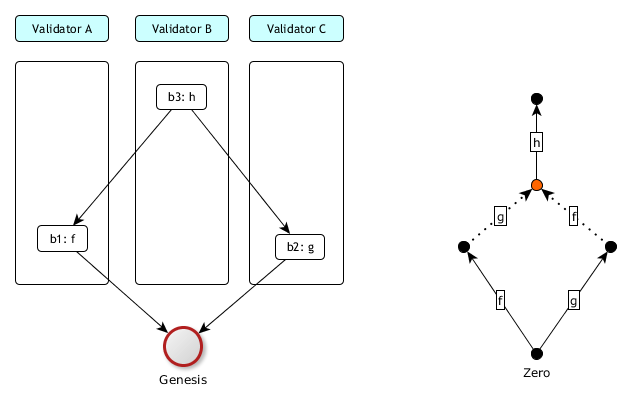

Let's again translate events to plain English:

1. Validators A and C independently proposed blocks $$b_1$$ and $$b_2$$. Block $$b_1$$ was executing transaction $$f$$. Block $$b_2$$ was executing transaction $$g$$.
2. Validator B discovered that blocks b1 and b2 are mergable, so he proposed block b3 by merging b1 and b2 and executing transaction h on top of it.

Please observe how the intermediate state $$f(g(Zero)) = g(f(Zero))$$ is hidden from the picture on the left and its existence is just implicitly given by fact that block $$b_3$$ has more than one parent.

To fully understand the transformation from blockdag to corresponding evolution graph, here is even more complex example:

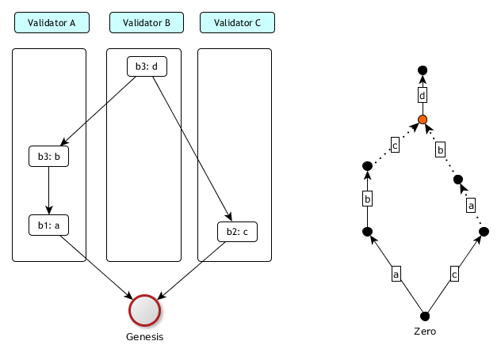

Crucial is to observe that once two mergable paths are discovered - in this case $$b \circ a$$ commutes with $$c$$ at state $$Zero$$ - the construction of implicit merged global state is by directly applying commutativity. So the merged state in this case is:

$$
c(a \circ b (Zero))
$$

.. which turns out to be equal to:

$$
a \circ b (c(Zero))
$$

thanks to blocks $$b_2$$ and $$b_3$$ being mergable, which by definition of mergability means that transactions $$b \circ a$$ and $$c$$ are commutative on global state Zero.

### Implementation of a shared database

We are now prepared enough to introduce an implementation for a shared database based on distributed consensus.

During his operation, a validator maintains two collections:
  *  **blockdag**: an ever-growing data structure which keeps a directed acyclic graph of blocks
  *  **blocks-buffer**: a buffer of blocks received, but not yet incorporated into blockdag
  
 Every validator $$v$$ is busy executing two infinite loops of processing (concurrently):

* Loop 1
  1. select a transaction $$t ∈ TR$$ to be executed as the next one
  2. select  a subset $$p$$ of  blockdag vertices (to be used as parents)
  3. create a new block $$B = <creator = v, transaction = t, parents = p>$$
  4. add $$B$$ to the local blockdag
  5. broadcast $$B$$ to all validators in the network

* Loop 2
  1. Listen do blocks incoming from other validators
  2. When a block $$B$$ arrived: check if all parents of B are already included in the blockdag. If yes - append $$B$$ to blockdag, else - append $$B$$ to blocks-buffer.
  3. Check if any block in blocks-buffer can now leave the buffer and be included in the blockdag, because all its parents are now in blockdag.
  4. Repeat step 3 as many times as needed.

How parents of a new block are selected (loop 1, step 2) is the most critical point of the whole distributed consensus. We call this the **fork choice rule**.

### Adding causal structure to blockdag

For the fork choice rule to be defined we need to enrich our model with some sort of causal structure. It could be thought of as "weak time" time and it can be considered a different solution of the same problem that [Lamport synchronization](https://en.wikipedia.org/wiki/Lamport_timestamps) solves. 

When a validator is going to propose a new block B, he will use the fork choice role against his copy of the blockdag to determine parents for B. We want to make the input data for making this decision to be sealed into B.

Formally, this means we require each block $$B$$ created by validator $$V$$ to contain a snapshot of a blockdag maintained by V at the moment of creating B.  Technically, thanks to the monotonic nature of blockdag, this snapshot can be equivalently encoded by just enumerating "generators", so a transitive reduction of the blockdag in question. So in basic words, it is enough to enlist bloks, from which all other blocks can be reached by traversing justification links.  We call this new field **justifications**.

To summarize, let's no state the improved definition of a block. A **block** is a tuple consisting of:

  * a validator
  * a transaction
  * a finite non-empty list of justification blocks
  * a finite non-empty list of parent blocks (must be a subset of transitive closure of justifications)
  
  In lame terms, a on creating a new block $$B$$, a validator seals into the block two sets of links:
  * justifications: means "what was my knowledge when I was creating block $$B$$"
  * parents: means "which paths of shared database evolution I am merging with block $$B$$"

  Both parent-child and justifications form directed acyclic graphs. They share the same set of vertices, only justification graph has possibly more edges. So, now within a single blockdag we have two DAGs:
  * $$pDAG$$: where arrows are from a block to its justificaton block
  * $$jDAG$$: where arrows are from a block to its parent

And we have an inclusion: $pDAG \subset jDAG$
$$$$

The structure of a block looks now like this:

$$
B = <creator , transaction: GS ⟶ GS, parents = <b_1, ..., b_n>, justifications=<j_1, ..., j_n>>
$$

To carry the enriched structure we have to adjust the way we draw blockdags.

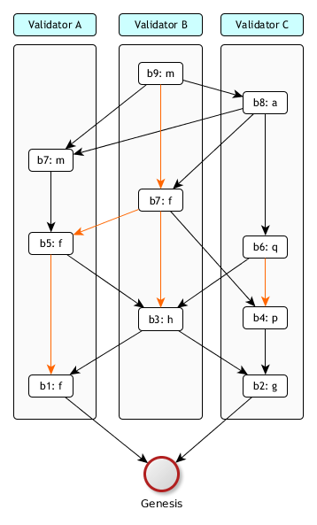

This drawing convention is:
* black arrows are from $pDAG$ d
* red arrows are from $jDAG \setminus pDAG$ 
* we avoid drawing redundant red arrows (so when a red arrow can be deduced as pats of red-or-block arrows)

### Equivocation

On the previous example, it looks like when a validator looks at his blockdag and when he focuses on his own swimline (so blocks he proposed), this swimline considered a subgraph of $$jDAG$$ is a chain. This is not surprising because, logically, when I am proposing a new block, all blocks I proposed so far are within my knowledge, so I am including them in justifications of the new block. At least I **should** do so.

So, if all validators are acting honestly in the above sense, then on our picture, all swimlines are going to be chains.

The problem is that in a distributed network of validators such an "honest" behaviour cannot be technically enforced. Instead, we have to accept that the reality will look like this:

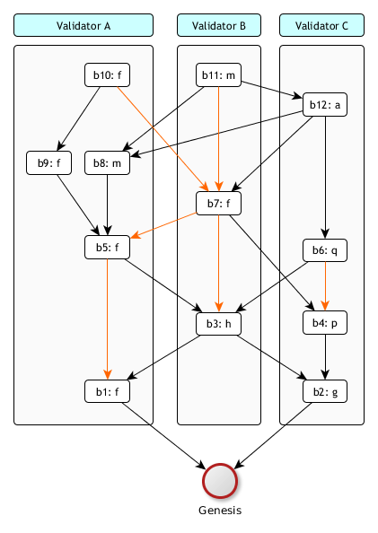

In this example, validator A violates the "honesty" rule by splitting his chain on block $$b_5$$. Both $$b_8$$ and $$b_9$$ are referencing $$b_5$$ and yet there are not visible to each-other via justifications. This looks like validator A is not aware of his own blocks he proposed !

We call this **equivocation**.

### Implementation remark: block hash

Of course we are trying to make a good balance between precision (given by mathematical description of the solution) and programmer's intuition (which goes much closer along the actual implementation details). These two perspectives are somethimes quite different. And one such thing is block hash.

On the mathematical side, we start with the space of global states $$GS$$, then we have the set $$TR$$ of transactions over $$GS$$, then we have the set of blocks over $$TR$$. As all this is formally based on first-order logic and set theory, the identity of blocks comes for free. Also they are immutable for free. The only thing we will need, that is still missing, is the total ordering on the set of blocks, but because every set can be well-ordered (Zermelo's theorem) we can fix any such ordering and just use it.

On the implementation side, the same set of goals is addressed in quite different way. Blocks are going to be pieces of data (so, encoded as byte arrays) exchanged between nodes. For having identity and immutability that cannot be tampered, we have digest functions and public-key cryptography. A side effect of this is that each block must include a digest (=hash) or its body and this hash can be used as block id. Also, this hash gives us a total ordering of blocks by lexicographic sorting of hashes. In this approach we of course ignore the fact, that collisions of hashes exist - by naive assumption that such a collistion will never happen in practice. 

### Scoring

The selection of candidates for parents of a new block starts with scoring phase. Scoring is a way of assigning an integer value to every block in a blockdag.

Scoring starts by finding the latest block in every swimline. This is easy for honest validators (because their swimlines are just chains). When equivocation are present, we pick the block with biggest p-height (where p-height is the length of longest path in pDAG from the block to Genesis).

In case more than one block having the biggest p-height, we take the one with smallest block hash.

This is how it worked for our last example:

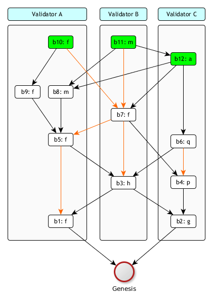

Please observe how for validator A we preferred block $$b_10$$ over $$b_8$$ because $$pHeight(b_10)=5$$ and $$pHeight(b_8)=4$$.

Let $$LastBlocks(blockdag)$$ denote the set of blocks chosen by the above algorithm. This is how scoring works:

$$
Score(block) = \{tip \in LastBlocks(blockdag): b \triangleleft tip \}
$$

## Fork choice

UNDER CONSTRUCTION

## Increment 1: dynamic set of validators

UNDER CONSTRUCTION

## Increment 2: multi-transactional blocks

UNDER CONSTRUCTION

## Increment 3: transaction fees

UNDER CONSTRUCTION

## Increment 4: proof-of-stake

UNDER CONSTRUCTION

## Finality

UNDER CONSTRUCTION

