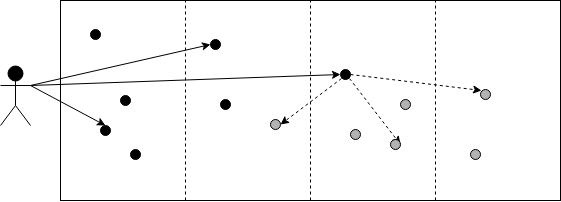

# Communications

## Node Discovery

Nodes for a peer-to-peer network, constantly communicating with each other to reach consensus about the state of the Blockchain. A Node is not necessarily a single physical machine, but it appears as a single logical entity to the rest of their peers by having a unique ID and address where it responds to requests.

Nodes periodically try to discover each other based on elements of the [Kademlia](https://en.wikipedia.org/wiki/Kademlia) protocol. Unlike the original Kademlia which was using UDP, Nodes are using point-to-point gRPC calls for communication. The specifics can be found under [Kademlia API](../appendix/grpc-interfaces.md#kademlia-api). According to this protocol every `Node` has the following properties:

* `id` is a Keccak-256 digest of the Public Key from the SSL certificate of the node
* `host` is the public endpoint where the node is reachable
* `discovery_port` is where the gRPC service implementing the `KademliaService` is listening
* `protocol_port` is where the gRPC service implementing the consensus related functionality is listening

The `KademliaService` itself has to implement only two methods:

* `Ping` is used by the `sender` to check if the callee is still alive. It also gives the callee the chance to update its list of peers and remember that it has seen the `sender` Node.
* `Lookup` asks the Node to return a list of Nodes that are closest to the `id` the `sender` is looking for, where distance between two Nodes based on the longest common prefix of bits in their `id`.

At startup the Nodes should be configured with the address of a well known peer to bootstrap themselves from. To discovery other Nodes they can pick from multiple strategies:

* Perform one-time lookup on their own `id` by the bootstrap Node \(which doesn't know them yet\) to receive a list of peers closest to itself. Recursively perform the same lookup with those peers to accumulate more and more addresses until there are nothing new to add.
* Periodically construct artificial keys to try to find peers at certain distances from `id` and perform a lookup by a random Node.

## Deployments

Clients send Deploys to one or more Nodes on the network who will validate them and try to include them in future Blocks. To do this Clients need to make a call to the `DeploymentService`. The specifics can be found under [Deployment API](../appendix/grpc-interfaces.md#deployment-api).

The `Deploy` message has the following notable fields:

* `session_code` is the WASM byte code to be executed on the Blockchain
* `payment_code` is the WASM byte code that provides funds in the form of a token transfer in exchange for the validators executing the `session_code` 
* `gas_price` is the rate at which the tokens transferred by the `payment_code` are burned up during the execution of the `session_code`
* `nonce` has to correspond to the next sequence number the Account sending the Deploy. The Nodes will hold on to the Deploy until the previous nonce has been included in the Block they are trying to build on.
* `account_public_key` is the public key associated with the Account and the one that is used to sign the Deploy. This is how Nodes can identify Accounts and find out what the currently expected nonce is.

Only existing Accounts can send Deploys. The way for a user to create an Account is to go to an exchange \(or friend\) that already has an Account and tokens and to pay them to create one for the user by calling a blessed contract on the Blockchain which will transfer tokens from the exchange to the user and store the users' public key on the chain as well. The exchange does this in form of a Deploy. As soon as that Deploy appears in one of the Blocks the user is free to send their own Deploys. To identify the Deploy in question the user has to know the public key of the exchange and the nonce it used to create the Account.

The user has to sign the request for which it has to calculate the hashes of all its parts. Currently the only supported hashing algorithm is Blake2b-256. If that needs to change in the future then the name of the algorithm will be added to the `Signature`.

## Block Gossiping

Nodes propose Blocks in parallel by finding Deploys that can be applied independently of each other. Whenever a new Block is formed, it has to propagate through the network to become part of the consensus. This is achieved by Nodes making calls to each other via gRPC to invoke methods on their `GossipService` interface which should be listening on the `protocol_port` of the `Node` that represents the peers in the network. The details of the service can be seen under [Gossiping API](../appendix/grpc-interfaces.md#gossiping-api).

### Principles

We call the method by which information is disseminated on the network _gossiping_. Gossiping means that when a Node comes across new bits of information it will relay it to a selection of its peers, who do the same, eventually saturating the network, i.e. get to the point where everyone has been notified.

Nodes need three layers of information about Blocks to be able to participate in the consensus:

1. Block meta-data, e.g. parent relationships, validator weights, state hashes.
2. Deploys that were included in given Block.
3. Global State, to be able to run the Deploys, validate Blocks and build new ones on top of them.

Out of these only the top two are gossiped between Nodes; the Global State they have to calculate themselves by running Deploys. 

We have the following requirements from our gossiping approach:

* It should be efficient, i.e. minimise the network traffic while maximising the rate at which we reach full saturation.
* Node operators should have a reasonable expectation that network traffic \(a finite resource\) will scale linearly with the amount of Deploys across the network while being less affected by the total number of Nodes. This means the load should be distributed among the peers rather than create hotspots.

To achieve these we have the following high level approach:

* Gossip only the meta-data about the Blocks to minimise the amount of data transfer. 
* Full Blocks can be served on demand when the gossiped meta-data is _new._
* Nodes should pick a _relay factor_ according to how much network traffic they can handle and find that many Node to gossip to, Nodes for which the information is _new_.
* Nodes should try to spread the information mostly to their closer peers but also to their farther away neighbours to accelerate the spread of information to the far reaches of the network.

### Picking Nodes for Gossip

As we established in the [Node Discovery](communications.md#node-discovery) section the Nodes maintain a list of peers using a Kademlia table. The table has one bucket for each possible distance between the bits of their IDs, and they pick a number _k_ to be length of the list of Nodes in each of these buckets that they keep track of. 

In statistical terms, half of the Nodes in the network will fall in the first bucket, since the first bit of their ID will either be 0 or 1. Similarly each subsequent bucket holds half of the remainder of the network. Since _k_ is the same for each bucket, this means that Nodes can track many more of their closest neighbours then the ones which are far away from them. This is why in Kademlia as we perform lookups we get closer and closer to the best possible match anyone knows about.

In practice this means that if we have a network of 50 Nodes and a _k_ of 10, then from the perspective of any given Node, 25 nodes fall into the first bucket, but it only tracks 10 of them, ergo it will never gossip to 15 Nodes from the other half that it doesn't have the room to track in its table.

We can use this skewedness to our advantage: say we pick a relay factor of 3; if we make sure to always notify 1 Node in the farthest non-empty bucket, and 2 in the closer neighbourhood, we can increase the chance that the information gets to those Nodes on the other half of the board that we don't track. 

The following diagram illustrates this. The black actor on the left represents our Node and the vertical partitions represent the distance from it. The split in the middle means the right side of the board falls under a single bucket in the Kademlia table. The black dots on in the board are the Nodes we track, the greys are ones we don't. As we can see we know few peers from the right side of the network, twice as many from the far half of left side, and again twice as many from the closest half of the left half. Once again this is because as we move closer there are more and more buckets to cover each of these areas. If we pick one Node in each area to gossip to, and the Node on the right side follows the same rule, it will start distributing our message on that side of the board more aggressively than bouncing it back on the left side.

