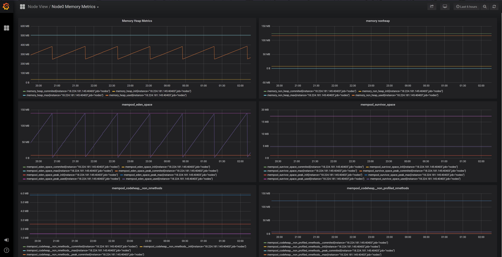

# Metrics

[A software metric is a standard of measure of a degree to which a software system or process possesses some property](https://en.wikipedia.org/wiki/Software_metric).
The CasperLabs node software is a complex distributed system. It is desirable that node operators manage, maintain, and tune their individual nodes for best reliability and efficiency. To do this, they require data on how various aspects of the node are functioning. Only by analyzing and visualizing this data can a node operator make educated decisions on how to deploy their software and hardware resources.
This data is also useful in the development process as a profiling instrument, with which we can detect anomalies in different components of software, monitor system resource consumption etc.

## Infrastructure
There are various instruments used gather, store and display metrics.

### Grafana
[Grafana](https://grafana.com/) allows you to query, visualize, alert on metrics. In CasperLabs it is used as a visualization engine and control panel, using configurable dashboards.
Grafana supposed to be used as the main entry point to work with metrics.
An example of configured Grafana dashboard:

### Kamon
[Kamon](https://kamon.io/) is a monitoring toolkit for applications running on the JVM. It gives you Metrics, Tracing and Context Propagation APIs without locking you to any specific vendor. All Kamon APIs are completely decoupled from the services that can receive the data.
The Kamon Metrics module is responsible of controlling the registration of entities being tracked either by user code or by instrumentation provided with other Kamon modules, as well as providing some necessary infrastructure like filtering, configuring instrument factories and dispatching metrics subscriptions to all interested parties.
Individual metrics in Kamon are kept by name. When a call is made to record or modify a metric (e.g. increment), the metric is created, located, and recorded by name. Developers should take care to be consistent in the use of names in order to avoid “split” metrics where events are recorded under more than one name.
It usually will act as an external API for metrics, which will make Grafana able to fetch values, but also could be used with any external tool just by querying it with HTTP.

### Prometheus
[Prometheus](https://github.com/prometheus) is a service monitoring system and time series database.
It works well for recording any purely numeric time series. It fits both machine-centric monitoring as well as monitoring of highly dynamic service-oriented architectures.
Prometheus scrapes metrics from instrumented jobs, either directly or via an intermediary push gateway for short-lived jobs. It stores all scraped samples locally and runs rules over this data to either aggregate and record new time series from existing data or generate alerts. Grafana or other API consumers can be used to visualize the collected data.

### Zipkin
[Zipkin](https://zipkin.io/) is a distributed tracing system. It helps gather timing data needed to troubleshoot latency problems. It manages both the collection and lookup of this data.
If you are troubleshooting latency problems or errors, you can filter or sort all traces based on the application, length of trace, annotation, or timestamp. Once you select a trace, you can see the percentage of the total trace time each span takes which allows you to identify the problem application.

### Sigar
Sigar is a library that provides a cross-platform, cross-language programming interface to low-level information on computer hardware and operating system activity thus, it is used to track the performance indicators the host machine.

### Influx
[InfluxDB](influxdata.com) is a time series database designed to handle high write and query loads. InfluxDB is meant to be used as a backing store for any use case involving large amounts of timestamped data, including DevOps monitoring, application metrics, and real-time analytics, commercial version supports sharding. It could be used as an alternative to Prometheus or together with it.

##
## Metrics API
Metrics API in the node software exposes several methods to track different kinds of metrics:
-   **Counters** -- Track the number of times certain event happened. It can only be increased. Useful for counting errors, cache misses, etc.
-   **Range Samplers** -- Used to track variables that increase and decrease very quickly, the most notable use case being tracking the number of concurrent requests or the number of elements in a queue.
-   **Gauges** -- Track a single value that can be increased, decreased or explicitly set. The common use case for gauges are slowly moving values like disk usage, number of loaded classes or configuration settings.
-   **Histograms** -- Record the distribution of values within a configurable range and precision. Typically used for recording latency, message sizes and so on.
-   **Timers**  Are just sugar on top of histograms that make it simple to track latency.

##
## Exposed metrics

Here will be a description of some metrics that already added to the Node. More will be added during the development process.

#### Counters

- `discovery.kademlia.handle.ping` - counts sent ping requests
- `discovery.kademlia.handle.lookup` - counts sent lookup requests
- `rp.handle.disconnect` - counts disconnects which are caused by received `Disconnect` messages
- `rp.connect.connect` - increments on each connection attempt
- `rp.transport.rp.round-trip` - increments on each round-trip
- `rp.transport.rp.send` - increments when node send a message to a peer
- `block-storage.*.get` - increments each time an attempt to get a block occurs
- `block-storage.*.put` - increments each time when a block is stored
- `block-storage.*.find` - increments each  time when searching for blocks happens
- `discovery.kademlia.grpc.protocol-lookup-send` - increments when kademlia lookup is sent

#### Gauges

- `discovery.kademlia.peers` - this value updates each time `KademliaNodeDiscovery` service adds or removes a node to it's peers table.
- `rp.connect.*.Connections` - number of cached peer connections

#### Timer
- `rp.connect.connect-time` - measures time taken the Node to connect to another Node, including protocol handshake.
- `discovery.kademlia.grpc.ping-time` - "ping" operation time.
- `discovery.kademlia.grpc.lookup-time` - "lookup" operation time.
- `rp.transport.round-trip-time` - "round-trip" operation time.
- `rp.transport.send-time` - "send" operation time.

### JVM metrics

Node collects a lot different JVM metrics which reflect the state of the virtual machine and whole application.

#### CPU

-   `process.cpu.time` - CPU time used by the process on which the JVM is running in nanoseconds
-   `process.cpu.load` - amount of CPU load

#### Memory

A lot of different memory metrics are collected.

Memory types considered:

-   Heap memory
-   Non-heap memory
-   Different JVM memory pools

For each memory type the following gauges collected:

-   Init memory
-   Commited memory
-   Max memory
-   Used memory

#### Threads

Gauges collected for threads:

-   Number of threads
-   Number of daemon threads
-   Peak number of threads
-   Total number of started threads

#### GC

Gauges collected for GC:

- `total-collections` - total number of collections that have occurred
- `total-collections-time` - accumulated collection time in ms
- `start-time` - start time of last GC since the JVM was started in ms
- `end-time` - end time of last GC since the JVM was started
- `duration` - elapsed time of last GC in ms
